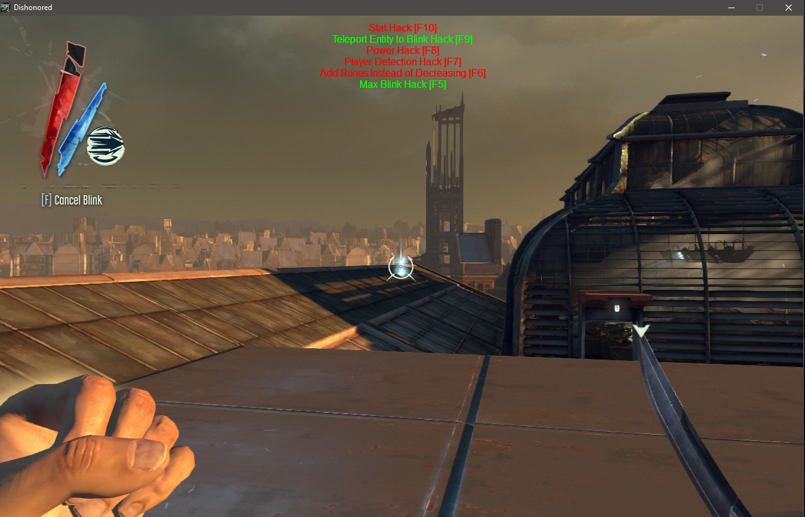

## Dishonored Internal Cheat

Inject into game once you are in game as injecting before the you load into a map may break the hack & cause it to crash.

### Features
- Infinite Stats
- Teleport entities except player to Last Blink Location
- Infinite Power Duration (Possession & Dark Vision)
- Disable Entities from alerting when you are seen
- Increase Runes instead of spending runes 
- Modify Blink Distance & Blink Height

### PS
If you read the code you may see my shoddy attempt of "ESP", I believe ive messed up the Viewport transformation function.
If you know how to implement that would be great

